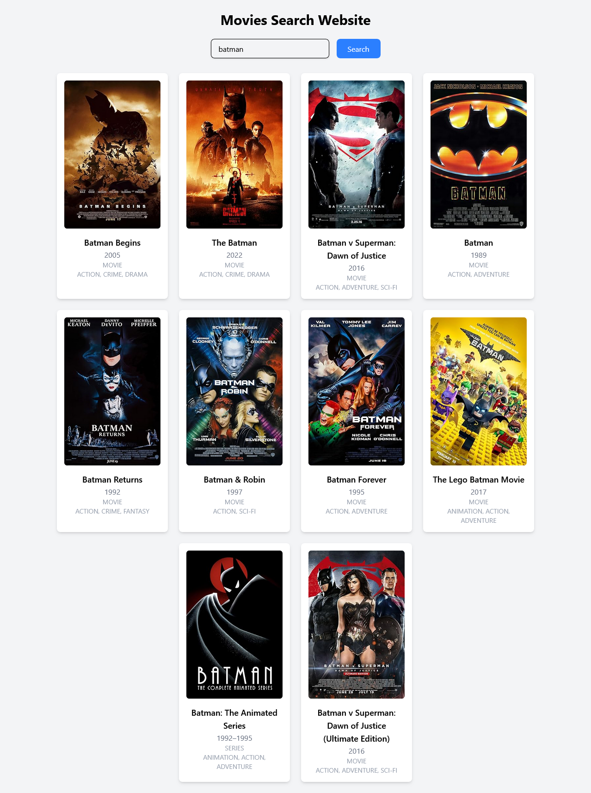

---

```markdown
# 🎬 Movie Search App

A simple React.js application that allows users to search for movies using the [OMDb API](https://www.omdbapi.com/).  
Deployed live on **Vercel** 🌐

---

## 🔗 Live Demo

👉 [Click to View Live](https://movie-search-webs.vercel.app/)

---

## 📸 Preview



---

## 🚀 Features

- 🔍 Search for movies by title
- 🎞️ Displays:
  - Movie poster
  - Title
  - Release year
  - Genre
- 📦 Fetches data from OMDb API
- ⚡ Built with React + Tailwind CSS
- ☁️ Hosted on Vercel

---

## 🛠️ Built With

- [React.js](https://reactjs.org/)
- [Tailwind CSS](https://tailwindcss.com/)
- [OMDb API](https://www.omdbapi.com/)
- [Vercel](https://vercel.com/) for deployment

---

## 🧩 Folder Structure

```
movie-search-app/
├── public/
├── src/
│   ├── components/
│   ├── assets/
│   ├── App.jsx
│   └── index.js
├── .gitignore
├── package.json
└── README.md
```

---

## 🔧 How to Run Locally

```bash
# Clone the repository
git clone https://github.com/samirzjadhav/movie-search-web.git

# Navigate into the directory
cd movie-search-web

# Install dependencies
npm install

# Start development server
npm run dev
```

> Make sure you add your own OMDb API key in a `.env` file:

```env
VITE_OMDB_API_KEY=your_api_key_here
```

---

## 📦 Deploy on Vercel

1. Push your code to GitHub
2. Go to [vercel.com](https://vercel.com/)
3. Click **New Project**
4. Import your repo
5. Add your environment variable (`VITE_OMDB_API_KEY`)
6. Click **Deploy**

---

## 📄 License

This project is licensed under the [MIT License](LICENSE).

---

## 🧑‍💻 Developed By

**Samir Jadhav**  
[Portfolio](https://samirj.vercel.app/) | [LinkedIn](https://linkedin.com/in/samirzjadhav) | [GitHub](https://github.com/samirzjadhav)

---

## 💬 Feedback

Feel free to open issues or submit pull requests.  
Star ⭐ this repo if you found it helpful!

```

